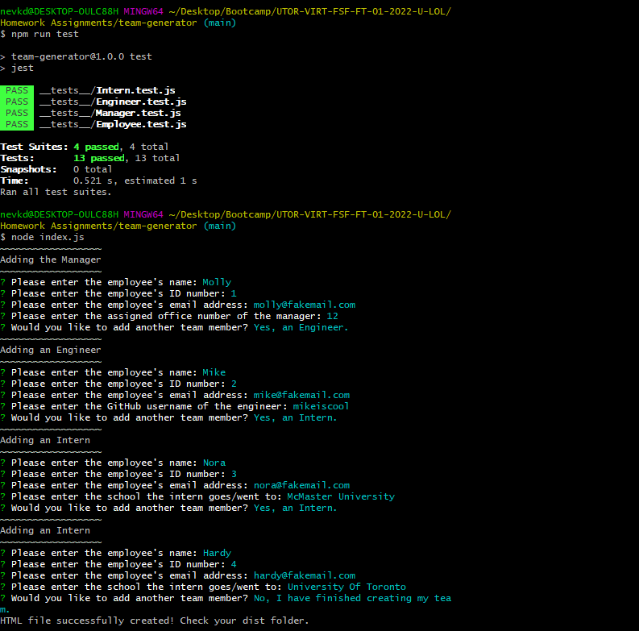

# team-generator

## Description

This is an application that allows the user to enter employee names, ids, emails, and other information, and then generates an HTML page with cards for each person, indicating whether they are a manager, an intern, or an engineer. To run the tests, you'll need the "inquirer" library and "Jest". 

> Github Repository Link: [https://github.com/nevan-dsouza/team-generator](https://github.com/nevan-dsouza/team-generator)
>
> Video Link: 

## Table of Contents

1. [Installation](#installation)
2. [Usage](#usage)
3. [Example](#example)
3. [License](#license)
4. [Tests](#tests)
5. [Questions](#questions)

## Installation

Type "npm install"/"npm i" in the console to install the dependancies this application requires (Inquirer and Jest). 

## Usage

The user must type "node index.js" in their console to run the file and answer the questions.

## Example

### Screenshot of the Program Running

### Video Demo

https://youtu.be/lfKq2-JguU0

## License

This project is not under any license.

## Tests 

Test cases are given in the __tests__ folder. Run "npm run test" to see. 

## Questions

My GitHub Page: [Bickolus](https://github.com/nevan-dsouza)
